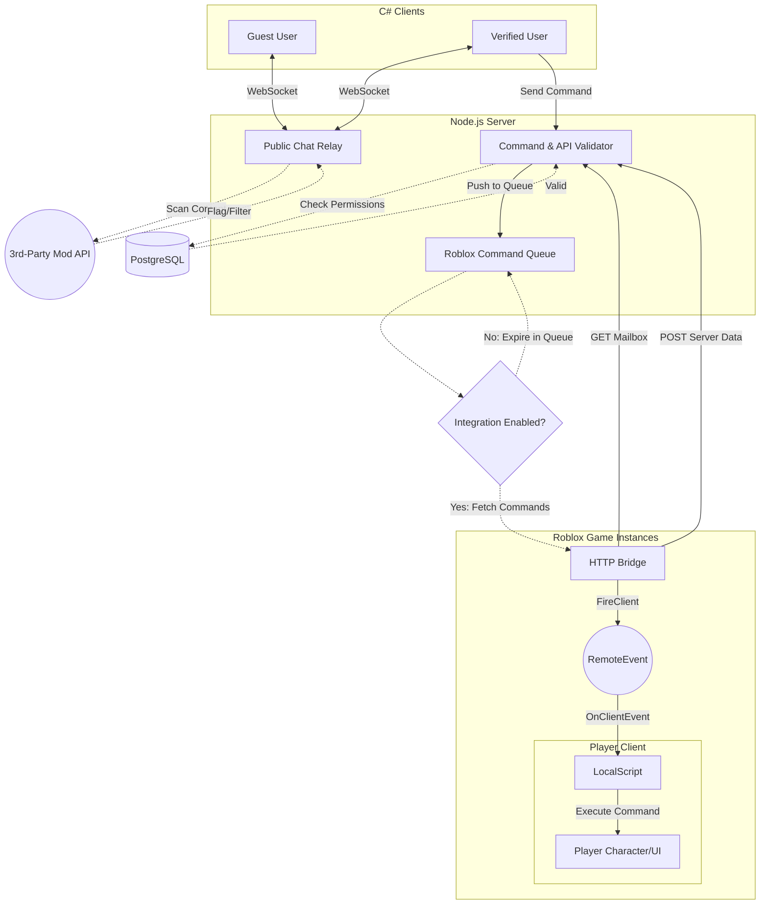

>[!NOTE]
> Privacy is the cornerstone of this project. Every contribution must prioritize user anonymity and data minimization. We do not accept features that require telemetry, invasive tracking, or the collection of personally identifiable information (PII).

<p align="center">
    
    
</p>

<div align="center">

[](CONTRIBUTING.md)
[](LICENSE)
[](#)
[](#)
[](#)
[](#)
[](#)
[](#)
[](#)
[](#)
[-%7BDont();%7D-brightgreen)](#)

</div>

<div align="center">

[](https://RobloxChatLauncher.onrender.com/api-docs)

</div>

---

# Contributing to Roblox Chat Launcher

This guide covers everything you need to start contributing: environment setup, testing, commit conventions, building the project, and submitting pull requests.

---

## 💡 How to Contribute

We follow a "Discussion First" workflow. To ensure your time is well-spent and your contribution aligns with the project’s roadmap, please follow these steps:

### 1. Identify a Task

* **New Ideas:** If you have a feature idea or found a bug, please open a [new issue](https://github.com/RobloxChatLauncher/RobloxChatLauncher/issues/new) to discuss first.
* **Existing Tasks:** Browse the [Issue Tracker](https://github.com/RobloxChatLauncher/RobloxChatLauncher/issues) for issues labeled `help wanted` or `good first issue`.

### 2. Propose Your Plan

Before writing code, leave a comment on the issue stating you would like to work on it. Your comment should briefly explain:

* How your approach aims to solve the problem and how you plan to implement the feature.
* Any new libraries, dependencies, or tools you plan to introduce.
* If applicable, what part of the codebase you plan to modify.
* If applicable, why this change is needed and other alternatives you've considered.

### 3. Get the Green Light

Once a maintainer acknowledges your plan and assigns you to the issue, you are clear to start!

---

## 🌍 Contributing Localizations 

<details>
<summary>Click to expand</summary>
<br>
  <p>
  Follow these steps to create and contribute a new localization for the Roblox Chat Launcher client.
  </p>

### Steps

1. Open the solution file (`RobloxChatLauncher.sln`) in **Visual Studio 2026**.

2. In the Solution Explorer, navigate to the `Localization` folder.

3. Open **any `Strings.resx` file**.

   Visual Studio will display a **combined localization table** showing all languages side-by-side.

4. Create a new language file:

   Right-click the folder → **Add → New Item → Resources File**

   Name it using the language code format:

   ```
   Strings.<language-code>.resx
   ```

   Examples:

   ```
   Strings.ru.resx   (Russian)
   Strings.fr.resx   (French)
   Strings.de.resx   (German)
   Strings.ja.resx   (Japanese)
   ```

5. After creating the file, it will appear as a **new column in the localization table**.

6. Use the other languages in the table as a reference and **fill in your translations**.

### Tips

- Keep translations **short and consistent with the UI**.
- **Placeholders like `{0}`, `{1}`, `{2}`, etc. must remain present in the translation**.
  - Example (correct): `User {0} joined server {1}` → `К серверу {1} присоединился пользователь {0}`
  - Example (incorrect): `User {0} joined server {1}` → `К серверу {1} присоединился новый участник`
- Do **not rename existing keys**.
- If a string is unclear, leave a comment in the pull request.

</details>

---

## 🎀 Quick Start

```powershell
gh repo fork RobloxChatLauncher/RobloxChatLauncher --clone --remote=true; if($?){ cd RobloxChatLauncher; git checkout -b feat/your-feature-name }
```

---

## 🏗️ Architecture Overview

Roblox Chat Launcher consists of:

- A C# desktop client (.NET 10)
- A Node.js backend server
- A PostgreSQL database
- An optional Windows installer (Inno Setup)

The client connects to the backend via WebSockets and REST endpoints.
The backend handles validation, session management, and database operations.

### Client (C# / .NET 10 / WinForms)

- Located in `/client`
- Entry point: `Program.cs`

#### Debug & Override Tools
When compiling the client in **Debug mode**, you can use environment variables to override default behavior without modifying the source code:

*   `APP_CULTURE`: Overrides the UI language (e.g., `$env:APP_CULTURE="zh-Hans"`).
*   `BASE_URL`: Overrides the backend endpoint. In Debug, the internal `Constants.BASE_URL` becomes `readonly` instead of `const` to allow the override.

#### Base URL Configuration

The backend base URL used by the client is defined in:

`Constants.cs`

Important formatting rules:

- Do not include a URI `https` or `wss`
- Do not include a colon `:`
- Do not include leading slashes `//`
- Do not include a trailing slash `/`

Example (correct):

`example.com`

Example (incorrect):

`https://example.com/`

### Server (Node.js / Express)

- Located in `/server`
- Entry point: `server.js`
- Uses Express for REST endpoints
- Uses WebSockets for real-time communication
- Requires a PostgreSQL database
- Requires a valid `DATABASE_URL` environment variable

The server will fail to start if PostgreSQL is not configured correctly.

> [!NOTE]
> **Deployment Lifecycle:** Frankfurt and Singapore clusters are typically the first to receive "canary" updates. Be aware that these regions may reflect changes before a global rollout.

### Communication Flow

User → C# Client → WebSocket/REST → Node.js Server → PostgreSQL



## 🛠️ Recommended Development Environment

To ensure your environment matches production builds:

### IDE & Toolchain

* **[Visual Studio 2026](https://visualstudio.microsoft.com/downloads/):** primary IDE; required to target .NET 10.0.
* **[.NET 10 SDK](https://dotnet.microsoft.com/en-us/download/dotnet/10.0):** the target framework for the C# client.
* **[Inno Setup 6.7+](https://jrsoftware.org/isdl.php):** for building the installer.
* **[Docker Desktop](https://www.docker.com/products/docker-desktop/):** to build images and deploy the back-end server.
* **[PostgreSQL 18+](https://www.postgresql.org/download/):** required to start the back-end server.
  * Must provide a valid `DATABASE_URL` environment variable.

### Testing & Virtualization

Use a sandboxed environment for safe testing:

* **[VirtualBox](https://www.virtualbox.org/wiki/Downloads) or any other hypervisor:** any hypervisor of choice (Type 2 virtualization is sufficient).
* **Some recommended disk images:**
  * **Windows 11:** full windows image.
    * [Download](https://www.microsoft.com/en-us/software-download/windows11)
  * **Tiny11 25H2 / Tiny11 Core 25H2:** minimal Windows 11 images.
    * [Download](https://archive.org/details/tiny11_25H2)
  * **Tiny11 Core Beta 1 (Windows 11 Pro 23H2, Build 22631.2361):** smaller minimal testing image.
    * [Download](https://archive.org/details/tiny-11-core-x-64-beta-1)

> [!CAUTION]
> **Tiny11 Core Safety Notes:**
>
> * Tiny11 Core is not a replacement for Tiny11; use for testing in a VM only.
> * Windows Defender is not included in Tiny11 Core. Exercise caution when browsing inside the VM.

## 📦 Compiling from Source

First things first, clone the repository and navigate to the root folder:

```powershell
git clone https://github.com/RobloxChatLauncher/RobloxChatLauncher
cd RobloxChatLauncher
```

<!-- Client -->
<details>
  <summary>Client (C#)</summary>

### Client (C#)
  
#### Prerequisites

* [.NET 10.0 SDK](https://dotnet.microsoft.com/en-us/download/dotnet/thank-you/sdk-10.0.101-windows-x64-installer)

#### Installation

Navigate to the `client/` folder:

```powershell
cd client/
```

Build and run the program:

```powershell
dotnet run
```
  
</details>

<!-- Server -->
<details>
  <summary>Server (Docker)</summary>

### Server (Docker)
  
#### Prerequisites

* [Docker Desktop](https://www.docker.com/products/docker-desktop/)

#### Installation

Navigate to the `server/` folder:

```powershell
cd server/
```

Build the Docker image:

```powershell
docker build -t roblox-chat-launcher .
```

Run the container:

```powershell
docker run -p 10000:10000 roblox-chat-launcher
```

Your server will now be accessible at `http://localhost:10000`.

</details>

<!-- Installer -->
<details>
  <summary>Installer (Inno Setup)</summary>

### Installer (Inno Setup)
  
#### Prerequisites

* [Inno Setup](https://jrsoftware.org/isdl.php)

#### Installation

Navigate to the `installer/` folder:

```powershell
cd installer/
```

Build the installer:

```powershell
iscc Installer.iss
```

</details>

---

## 💬 Commit Message Guidelines

All commits **must follow [Conventional Commits v1.0.0](https://www.conventionalcommits.org/en/v1.0.0)**.

> [!IMPORTANT]
> **Use Scopes!**
> 
> Please make sure that every commit type includes a scope indicating the part of the project affected (e.g., `client`, `server`, `installer`, `docs`).

### Examples

| Commit Message | Description |
| :--- | :--- |
| `feat(client):` add WebSocket listener for server instance IDs | Adds a new functional feature to the C# client. |
| `fix(server):` resolve memory leak in connection pooling | Fixes a bug within the Node.js/Express backend. |
| `refactor(client):` clean up input capture logic | Improving code structure without changing behavior. |
| `perf(server):` optimize message broadcasting latency | A change specifically focused on improving speed. |
| `chore(installer):` update Inno Setup script for .NET 10.0 | Routine maintenance or dependency updates. |
| `docs(readme):` add security research citations for Persona | Documentation-only changes. |

### Common Commit Types

* `feat(scope):` new feature
* `fix(scope):` bug fix
* `refactor(scope):` code changes that don’t add features or fix bugs
* `infra(scope):` changes to core infrastructure
* `perf(scope):` performance improvements
* `chore(scope):` maintenance tasks
* `docs(scope):` changes or additions to documentation

### Approved Scopes

<details>
  <summary>Click to expand</summary>
    
* `client` all types
* `server` all types
* `installer` all types
* `integrations` all types
* `web` all types
* `ci` all types
* `test` all types
* `readme` chore or docs
* `contributing` chore or docs
* `legal` chore or docs
* `assets` chore
* `docs` chore
* `deps` chore
* `gitattributes` chore
* `gitignore` chore

</details>

## 💻 Development Guidelines

* Follow existing code style for C# and JavaScript.
* Keep commits small, descriptive, and scoped.

---

## 📥 Installing Roblox Chat Launcher from CLI in a VM

<details>
  <summary>Click to expand</summary>
  <br>
  <p>
    Follow these steps to install .NET 10 and Roblox Chat Launcher 
    <strong>without Git, GitHub CLI, or a browser</strong>. 
    This guide is intended for usage in a minimal virtual machine for the purposes of testing; 
    prefer conventional methods such as <code>git clone</code> elsewhere.
  </p>

  <h3>One-Line Installation</h3>
  <p>
    Run the following in <b>PowerShell</b> to perform all setup steps automatically, 
    including creating directories, installing .NET (Runtime or SDK), 
    and downloading Roblox Chat Launcher (source or release executable):
  </p>

  <pre><code>iex (iwr -useb https://raw.githubusercontent.com/RobloxChatLauncher/RobloxChatLauncher/main/.github/scripts/setup_vm.ps1); setup -Mode SDK -Branch main
</code></pre>

  <p><strong>Options:</strong></p>
  <ul>
    <li><code>-Mode Runtime</code> – installs the .NET Desktop Runtime</li>
    <li><code>-Mode SDK</code> – installs the full .NET SDK</li>
    <li><code>-Branch &lt;branch|tag|commit&gt;</code> – download a specific branch, tag, commit hash, or release tag if -UseReleaseExe</li>
    <li><code>-UseReleaseExe</code> – download the first release .exe instead of source code</li>
  </ul>
</details>

---


## 📜 Pull Request Checklist

* [ ] Builds successfully.
* [ ] Commits follow Conventional Commits.
* [ ] Changes documented clearly.
* [ ] Used `Localization.Strings.Key` for all UI text.
* [ ] I agree that my contributions will be licensed under the **GNU GPLv3**.
